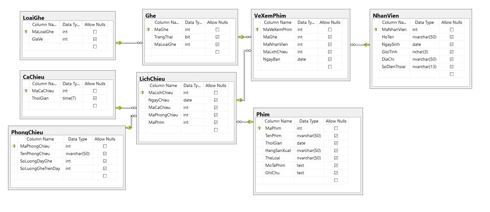

# Xây dựng phần mềm Quản lý vé xem phim
#### Cơ sở dữ liệu


#### Frame Main


#### Nhập lịch chiếu


#### Nhập thông tin film


#### Nhập thông tin film


#### Nhập thông tin phòng chiếu

#### Nhập thông tin loại ghế

#### Nhập thông tin nhân viên

#### Xem lịch chiếu phim

#### Nhập vé

#### Nhập vé

#### Tìm kiếm

# Thiết kế CSDL 
Trong 1 bảng yêu cầu tối thiểu các Procedure sau
|Tên Proceure|Công dụng|
|:----------|:-------|
|1. Insert|Thêm dữ liệu vào một bảng|
|2. Update|Cập nhật|
|3. Delete|Xóa|
|4. Select All|Xem tất cả|

# Tổ chức thư mục
|Tên thư mục|Công dụng|
|:---------|:--------|
|1. GUI: Graphic User Interface|Lưu trữ Form hay giao diện người dùng|
|2. BLL: Bullstet Logic Layer|Xử lý các thao tác mang tính nghiệp vụ, Kiểm tra tính logic trong công việc thực tế|
|3. Classes|Lưu trữ các tiện ích chung</br>EX: Những biến dùng chung|
|4.	DAL (Data Set Layer)|Xử lý công việc liên quan tới dữ liệu|
|5.	Entity |Mỗi entity tương ứng với một table trong CSDL|
|6.	Reports |In ra các bản báo cáo, hóa đơn => để in ra hóa đơn|

# Cấu trúc chương trình chung
__Bước 1__ : Tạo class __Classes/Variable.cs__ :lưu trữ các biến toàn cục dùng chung. </br>VD : tên nhà hàng - sau này khi muốn đổi tên nhà hàng thì ta thay ở trong này => nó sẽ auto cập nhật những thông tin liên quan  </br>
```Csharp
using System;
using System.Collections.Generic;
using System.Linq;
using System.Text;
using System.Threading.Tasks;

namespace QuanLyVeXemPhim 
{
    public static class Variables
    {
        /* 
            Infomation for connect to database 
        */
        // Server name
        public static string ServerName = "";
        // DatabaseName
        public static string DatabaseName = "";
        // UserName
        private static string UserName = "hieu";
        // PW
        private static string Password = "123456c@";


        /* 
            Global Variable 
        */
        private static string TenDonViSudung = "Movie Theater";
        private static string DiaChi = "236 Hoàng Quốc Việt";

    }
}

```